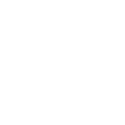

# Animal-Intrusion-Detection
We address the alarming rise of animal-inflicted harm in residential areas, proposing an image classification-based identification system for enhanced safety.  The research highlights the urgent need for improved safety measures, especially in residential lifts, to protect children and the elderly from stray animal attacks.
 

  

#  Representation of Display Panel using HCI Principle.

  

## Table of contents

- [Overview](#Overview)
- [Contributions](#Contributions)
- [Literature Review](#literaturereview)
- [Connect with me!](#connectwithme)

## Overview
Recently, a new alarming problem has emerged, particularly in residential areas,where dogs and other animals have inflicted substantial harm on children, the elderly, and others arising from stray animals. The severity of such incidents has escalated, leading to serious injuries and even fatalities. In India, these incidents have occurred within the confined environment of residential lifts. In order to address this pressing issue, this paper proposes an innovative solution: implementing an image classification-based identification system. In this study, ten distinct animal classes are classified using the Animals-10 dataset. In order to implement this idea, Convolutional Neural Networks (CNN) and pre-trained architectures like ResNet50 and EfficientNetB7 have been used. Improved results were achieved by fine-tuning these models. The metric used for evaluation was accuracy, ensuring the highest level of improvement. This work achieved an accuracy of 81.65% using CNN and an accuracy of 93.53% using ResNet50. However, we achieved the best results using the EfficientNetB7 model and by fine-tuning it further. The maximum test accuracy obtained is 98.52%. To demonstrate the effectiveness of the work, a comparative study with the previous work is included.

## Contributions 

1. The team has proposed a customised CNN model and a transfer-learning
approach like ResNet50 and EfficientNetB7 for classifying images of animals in
surroundings such as elevators, parks and other residential areas.
2. The transfer learning models have been trained and tested on animal (fauna)
images. The images are obtained from Google Photos and have been published in
a publically available dataset Animals-10. The dataset contains 28000 images of
animals divided into 10 classes. Furthermore, augmentation of images is performed
for higher impact.
3. This work has performed adjustments of various hyperparameters to obtain the
best performance possible.
4. The underlying idea of this work is to design an approach to ensure the co-existence
of animals (pets) and humans in a confined residential area. A comparative study
comprising the latest previous works has been conducted to show the effectiveness
of the work.

### Literature Review

  

### Connect with me!

- ⭐️ Star [`FieryDeveloper` on GitHub]([https://github.com/themerdev/themer](https://github.com/FieryDeveloper))
- 📧 [Mail me:amoghag2003@gmail.com]

